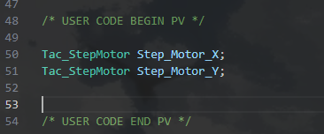
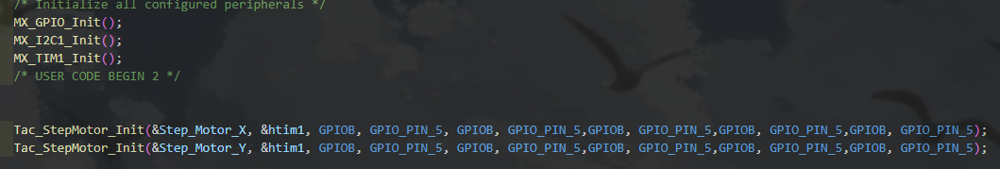
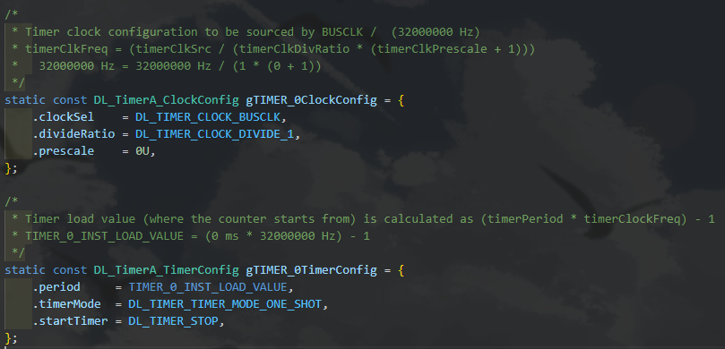
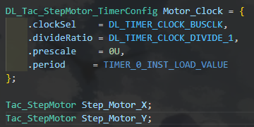

# FPNU IC

用于 TI G3507 和 STM32 HAL 平台开发的基于 TMC2209 的步进电机驱动，可以用于电赛。

## 使用案例
### 云台

#### STM32 HAL库：

##### 1. 预先声明云台结构体
```c
Tac_StepMotor Step_Motor_X;
```


##### 2. 初始化
```c
Tac_StepMotor_Init(&Step_Motor_X, &htim1, GPIOB, GPIO_PIN_5, GPIOB, GPIO_PIN_5, GPIOB, GPIO_PIN_5, GPIOB, GPIO_PIN_5, GPIOB, GPIO_PIN_5);
```


#### 3. 控制
```c
Motor_Forward_Angle(&Step_Motor_X, 32.1, 64, 'T', 1000);
```


#### TI MSPM0G3507：
##### 由于TI平台特殊性,需要预先定义定时器的配置。可以在ti_msp_dl_config.c中找到相关配置。
```c
/*
 * Timer clock configuration to be sourced by BUSCLK /  (32000000 Hz)
 * timerClkFreq = (timerClkSrc / (timerClkDivRatio * (timerClkPrescale + 1)))
 *   32000000 Hz = 32000000 Hz / (1 * (0 + 1))
 */
static const DL_TimerA_ClockConfig gTIMER_0ClockConfig = {
    .clockSel    = DL_TIMER_CLOCK_BUSCLK,
    .divideRatio = DL_TIMER_CLOCK_DIVIDE_1,
    .prescale    = 0U,
};

/*
 * Timer load value (where the counter starts from) is calculated as (timerPeriod * timerClockFreq) - 1
 * TIMER_0_INST_LOAD_VALUE = (0 ms * 32000000 Hz) - 1
 */
static const DL_TimerA_TimerConfig gTIMER_0TimerConfig = {
    .period     = TIMER_0_INST_LOAD_VALUE,
    .timerMode  = DL_TIMER_TIMER_MODE_ONE_SHOT,
    .startTimer = DL_TIMER_STOP,
};
```


##### 复制该配置，然后声明下面的结构体:
```c
DL_Tac_StepMotor_TimerConfig Motor_Clock = {
    .clockSel    = DL_TIMER_CLOCK_BUSCLK,
    .divideRatio = DL_TIMER_CLOCK_DIVIDE_1,
    .prescale    = 0U,
    .period     = TIMER_0_INST_LOAD_VALUE
};
```
##### 然后正常声明电机结构体即可:
