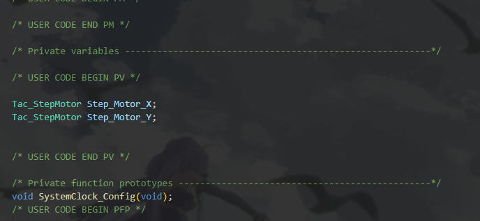

FPNU IC

用于TI G3507和STM32 HAL平台开发的基于TMC2209的步进电机驱动，可以用于电赛。

使用案例:
    云台:
        预先声明云台结构体的名称:
        Tac_StepMotor Step_Motor_X;
        

        初始化:
          Tac_StepMotor_Init(&Step_Motor_X, &htim1, GPIOB, GPIO_PIN_5, GPIOB, GPIO_PIN_5,GPIOB, GPIO_PIN_5,GPIOB, GPIO_PIN_5,GPIOB, GPIO_PIN_5);
        

        控制:
        Motor_Forward_Angle(&Step_Motor_X, 32.1, 64, 'T', 1000);
        
